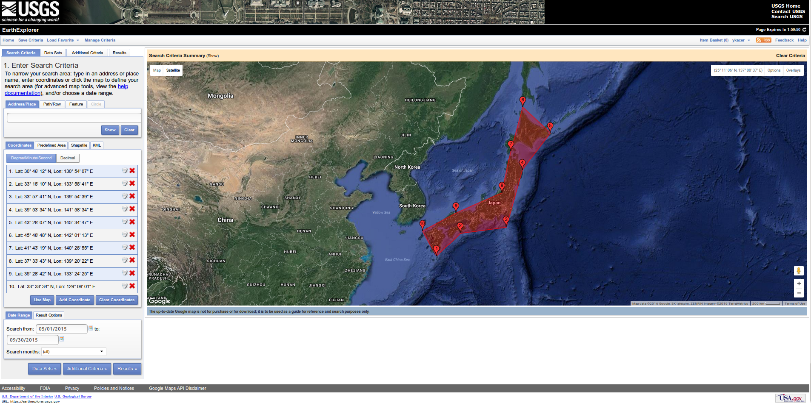
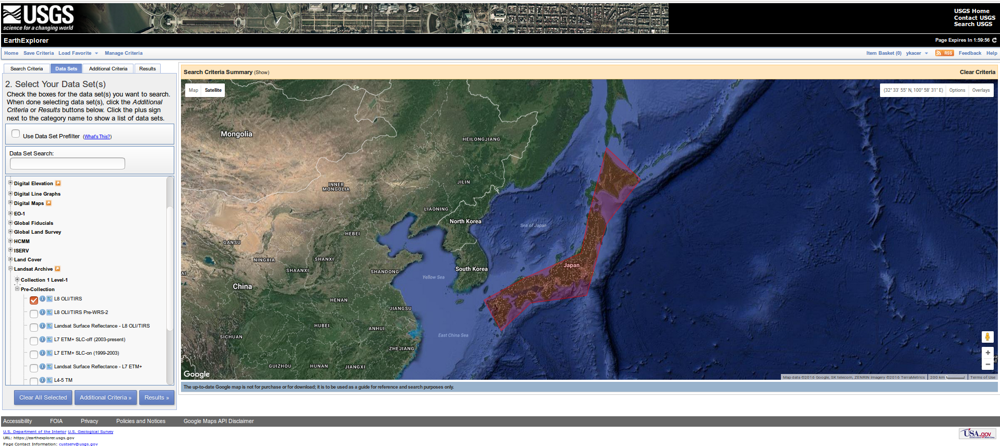
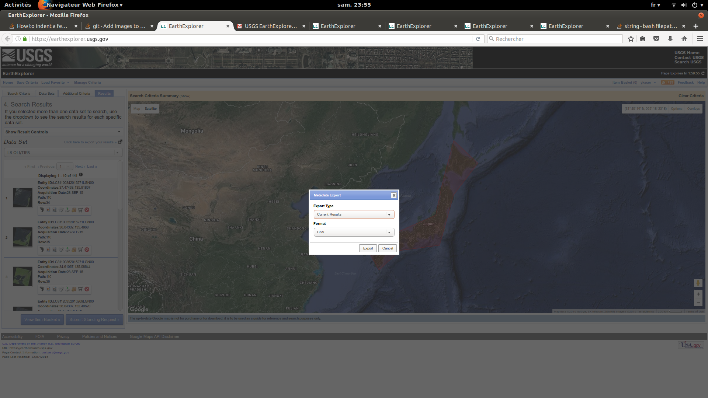
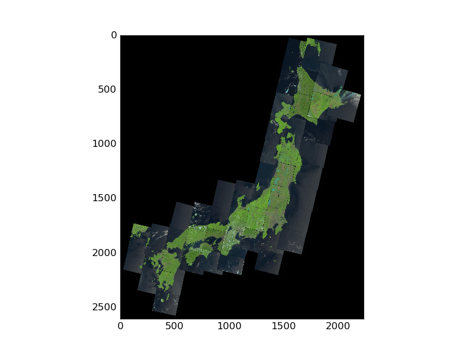

# High-resolution satellite images for human density prediction

Here after, we describe step by step how to build a human density map prediction for a certain country using one of our built predictive model.
In this tutorial, we use Japan as example, feel free to send an email at [youcef.kacer@gmail.com](youcef.kacer@gmail.com) if you face any problem, or directly open an [issue](http://github.com/ykacer/CES_Data_Scientist_2016/issues).

## Bring metadata
First of all, we need a list of Japanese cities with their surfaces in km² (and optionally populations, only useful to compute error on prediction).
[Wikipedia](https://en.wikipedia.org/wiki/List_of_cities_in_Japan) brings us such a table taken from Japan Institute from 2007.
Just copy paste the table in a csv file and rename header like above (This is just a pure formatting convention):

- rename header surface as 'SURFACE'
- rename header population as 'PMUN13', 'PMUN14', 'PMUN15' or 'PMUN16'
- rename header city as 'LIBMIN'

The file should look like this :

<pre>
LIBMIN				 	Japanese 	Prefecture 	PMUN15	 	SURFACE

Nagoya					名古屋市	 Aichi 		 2283289 	 326.45 	

Toyohashi 				豊橋市		Aichi 		377045 		261.35 

Okazaki 				岡崎市		Aichi 		371380 		387.24
</pre>

Then, store the file as `data/Japan/p_s_Japan.csv`.

## Bring geolocalizations cities
We now need to localize precisely each of the cities using `geopy`, a Python module to query geolocalisations (latitude and longitude). 
Use file `code/python/geo/locator.py` as follow :

`python code/python/geo/locator.py data/Japan/p_s_japan.csv data/Japan/p_s_c_japan.csv "\t" Japan Prefecture `

The third parameter is the separator used in the csv file.
The last two parameters are optional, they can be helpful for successful geolocalization when using geolocator `GoogleV3`:
- the country to which cities belong
- the name of the column that provide information of region, state or prefecture for each city

This operation can take several hours as the `GoogleV3` geolocator used, doesn't allow too much queries and some pauses are imposed by Google.
You should get a new file `data/Japan/p_s_c_japan.csv` containing now all metadata needed : name, surface, population, latitude and longitude for each city. 

## Bring Landsat-8 satellite images data
Now, we need to query images from USGS website. Be sure that you get a (free) login to export your query in a csv file.

First, make a polygon containing Japan and put a data time range big enough to contain a summer period :

  

Be sure that you enable a large amount of data results into Results Options window (from 100 to 500 could be enough) :

  

Then, specify the nature of datasets needed (sensors OLI/TIRS)

  

Add some conditions to your queries in terms of cloud covering (<20%) and day/night selection (day):

  

Finally get your results and export it as a CSV file

  

You should get a zip file whose name has the form of `LANDSAT_8_XXXXXX.zip`, unzip the containing into `data/Japan` folder.
You have now all information to get Landsat-8 datasets but we need to remove redundant ones (same path,row). The following bash file do this automatically, keeping the less cloudyness dataset for a certain path,row :

`./code/utils/landsat/landsat-8-clean data/Japan/LANDSAT_8_XXXXXX.csv`

You should obtain a lighter file `data/Japan/LANDSAT_8_XXXXXX_clean.csv`, gathering all datasets we will use for feature extraction.

We can verify that this last file contains datasets that covers all the territory. The following bash file download thumbnails of the datasets and project them in a map:

`./code/utils/landsat/landsat-8-draw data/Japan/LANDSAT_8_XXXXXX_clean.csv`

 The resulting image is `data/Japan/covering-selection.png` and you should verify that the territory is well covered (if no, enlarge the time range, or increase the cloudyness from 20% to 30%)

  

## Compute NDVI (vegetal indice) histogram for each city

Now, simply run :

 `python code/python/core/ndvi_features.py data/Japan/p_s_c_japan.csv data/Japan/LANDSAT_8_XXXXXX_clean.csv 15`

the number '15' is optional and corresponds to the header name 'PMUN15' we talked about when formatting metadata.
The script will download each datasets and form corresponding NDVI image.
You should obtain `data/Japan/ndvi_features.csv` containing 1024-size NDVI vector for each city, the explanatory variables if you want.

## Density prediction

Ok, we are now able to finally get our density prediction using one of our built model, Neural Network built model for example:

`python code/python/ndvi_test_classification.py data/Japan/ndvi_features.csv model_classification/Neural_Network_Classification-oversampling/Neural_Network_Classification-oversampling.pkl`

A new folder `data/Japan/test/Neural_Network_Classification-oversampling` will then be automatically created, that contains:

* `density_ground_truth.png` (available only if true population is provided in medatada csv file)
* `density_classification.png` for the predictions made by the model. 

Note that here, the ground truth correspond to 2007 Japan Government Institute while the prediction corresponds here to 2015 landsat-8 images.
